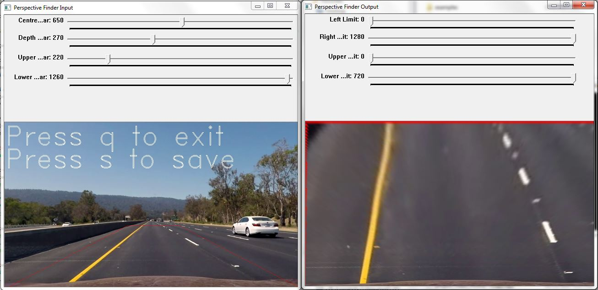
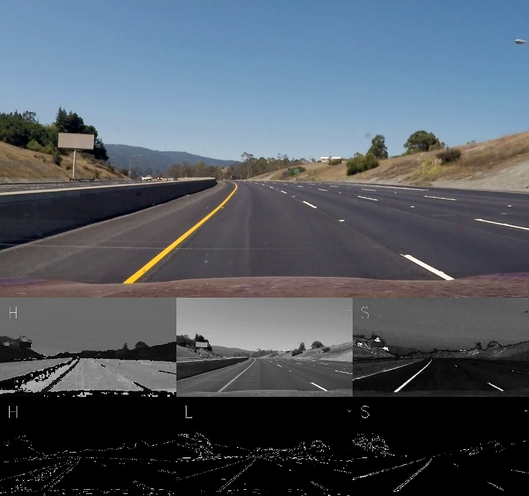
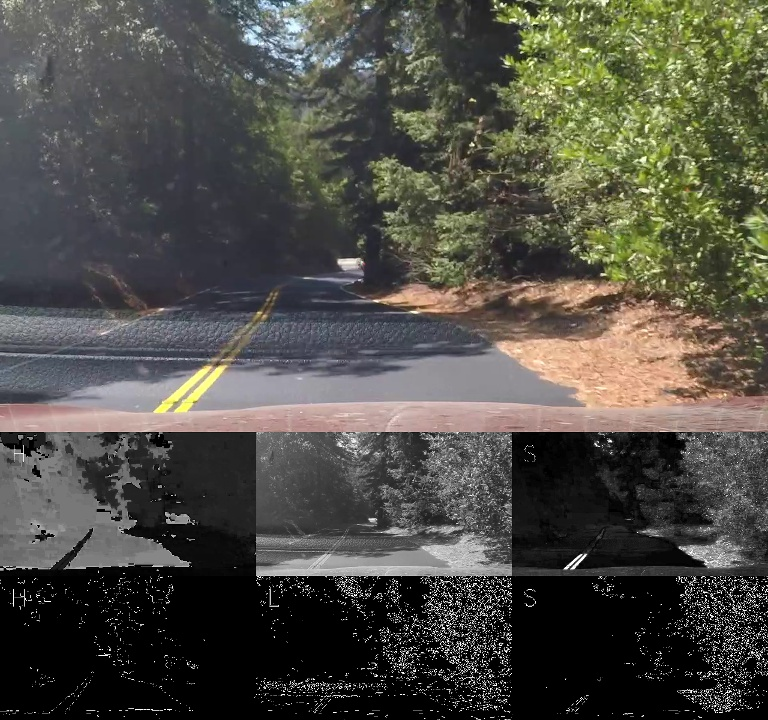

# Udacity Self Driving Car Nanodegree - Project 4
## Advanced lane finding

The aim of this project is to build upon the work carried out for [project 1](https://github.com/lewisHome/p1_LaneLines) and develop an image processing pipeline to identify lane markings. However in contrast to the pipeline developed in project 1 this pipeline must be able to measure the radius of curvature of any corners and calculate the position of the car with respect to the centre of its lane.

Further to the video files provided in the [Udacity project repository](https://github.com/udacity/CarND-Advanced-Lane-Lines) I decided to collect my own video files too. My repository includes some urban and rural driving collected around Melbourne as well as some rural driving collected from the Highlands of Scotland. I decided to collect this extra data because eventually autonomous cars will have to be able to navigate roads of varying quality, by testing my pipeline on these varying conditions it highlights to me just how insufficient my code is.

The videos collected for this project have been collected by different cameras from around the world so I developed some modules to allow easy analysis of the data.

### Camera Callibration
The program [Camera_Callibration.py](camera_callibration.py) is a utility to callibrate the camera used to collect the video data. The method is b based on the method detailed in the [OpenCV Documentation](http://opencv-python-tutroals.readthedocs.io/en/latest/py_tutorials/py_calib3d/py_calibration/py_calibration.html). To use the utility call the function from the command line
    
    $ python Camera_Callibration.py -camera_images -show_images -nx -ny


where;

-camera_images is the file containing the callibration images

-show_images is a flag to view the callibration images as they are being processed

-nx is the number of internal corners horizontally across the callibration image

-ny is the number of internal corners vertically across the callibration image

This utility outputs 4 .npy files which hold the callibration constants for to remove the inherant distortion from the camera images and are written to the file containing the callibration photos.

### Lane Finding
The program [lane_finder.py](lane_finder.py) can be run from the command line.

    $python lane_finder.py -camera_data -test_data -output_file
    
Here;

-test_data is the video file you wish to process

-camera data should be the file containing the callibration data obtained by running the camera callibration utlilty described earlier. The program uses the Udacity Camera as default.

-output_file is the file path where you would like to store all processed data. This defaults to the 'output_images'

On startup if this is the first time the video has been run you will be prompted to run the perspective finder utility.

#### Perspective Finder Utility
I built the perspective finder so that I could easily modify the perspective transform for different videos. To run the utility press 'c' to callibrate while running lane_finder.py. It is best to run this routine on a straight piece of road if possible



Adjust the sliders above the images to adjust the perspective transformation. Once you are happy press 's' to save the the perspective transformation. Saving the trasnformation will overwrite any existing transformation associated with the video so press 'q' if you wish to quit without saving.

#### Lane Finding Method

To find the lanes in the video images I take the following approach.

1.) Convert the colour image in to the HLS colour space and split the image into 3 black and white images for each colour channel. The reason I did this is because under different lighting conditions different channels do a better job of highlighting lane lines.

Good Lighting | Bad Lighting
--------------|-------------
|

As the above images show in good light the lane lines appera very sharply in the S and L channels however under bad lighting conditions the lanes appear more clearly in the H Channel.

2.) The next step is to find determine what is and what is not a lane in the video files. To do this I first detect edges using a canny edge detection method on the standard input images. Next I perform a perspective transform to provide a top down view of the image. On the transformed image I then use a sobel operator to find image gradients.

[Edges](examples/Edges.jpg)


**Advanced Lane Finding Project**

The goals / steps of this project are the following:

* Compute the camera calibration matrix and distortion coefficients given a set of chessboard images.
* Apply a distortion correction to raw images.
* Use color transforms, gradients, etc., to create a thresholded binary image.
* Apply a perspective transform to rectify binary image ("birds-eye view").
* Detect lane pixels and fit to find the lane boundary.
* Determine the curvature of the lane and vehicle position with respect to center.
* Warp the detected lane boundaries back onto the original image.
* Output visual display of the lane boundaries and numerical estimation of lane curvature and vehicle position.

[//]: # (Image References)

[image1]: ./examples/undistort_output.png "Undistorted"
[image2]: ./test_images/test1.jpg "Road Transformed"
[image3]: ./examples/binary_combo_example.jpg "Binary Example"
[image4]: ./examples/warped_straight_lines.jpg "Warp Example"
[image5]: ./examples/color_fit_lines.jpg "Fit Visual"
[image6]: ./examples/example_output.jpg "Output"
[video1]: ./project_video.mp4 "Video"

## [Rubric](https://review.udacity.com/#!/rubrics/571/view) Points

### Here I will consider the rubric points individually and describe how I addressed each point in my implementation.  

---

### Writeup / README

#### 1. Provide a Writeup / README that includes all the rubric points and how you addressed each one.  You can submit your writeup as markdown or pdf.  [Here](https://github.com/udacity/CarND-Advanced-Lane-Lines/blob/master/writeup_template.md) is a template writeup for this project you can use as a guide and a starting point.  

You're reading it!

### Camera Calibration

#### 1. Briefly state how you computed the camera matrix and distortion coefficients. Provide an example of a distortion corrected calibration image.

The code for this step is contained in the first code cell of the IPython notebook located in "./examples/example.ipynb" (or in lines # through # of the file called `some_file.py`).  

I start by preparing "object points", which will be the (x, y, z) coordinates of the chessboard corners in the world. Here I am assuming the chessboard is fixed on the (x, y) plane at z=0, such that the object points are the same for each calibration image.  Thus, `objp` is just a replicated array of coordinates, and `objpoints` will be appended with a copy of it every time I successfully detect all chessboard corners in a test image.  `imgpoints` will be appended with the (x, y) pixel position of each of the corners in the image plane with each successful chessboard detection.  

I then used the output `objpoints` and `imgpoints` to compute the camera calibration and distortion coefficients using the `cv2.calibrateCamera()` function.  I applied this distortion correction to the test image using the `cv2.undistort()` function and obtained this result: 

![alt text][image1]

### Pipeline (single images)

#### 1. Provide an example of a distortion-corrected image.

To demonstrate this step, I will describe how I apply the distortion correction to one of the test images like this one:
![alt text][image2]

#### 2. Describe how (and identify where in your code) you used color transforms, gradients or other methods to create a thresholded binary image.  Provide an example of a binary image result.

I used a combination of color and gradient thresholds to generate a binary image (thresholding steps at lines # through # in `another_file.py`).  Here's an example of my output for this step.  (note: this is not actually from one of the test images)

![alt text][image3]

#### 3. Describe how (and identify where in your code) you performed a perspective transform and provide an example of a transformed image.

The code for my perspective transform includes a function called `warper()`, which appears in lines 1 through 8 in the file `example.py` (output_images/examples/example.py) (or, for example, in the 3rd code cell of the IPython notebook).  The `warper()` function takes as inputs an image (`img`), as well as source (`src`) and destination (`dst`) points.  I chose the hardcode the source and destination points in the following manner:

```python
src = np.float32(
    [[(img_size[0] / 2) - 55, img_size[1] / 2 + 100],
    [((img_size[0] / 6) - 10), img_size[1]],
    [(img_size[0] * 5 / 6) + 60, img_size[1]],
    [(img_size[0] / 2 + 55), img_size[1] / 2 + 100]])
dst = np.float32(
    [[(img_size[0] / 4), 0],
    [(img_size[0] / 4), img_size[1]],
    [(img_size[0] * 3 / 4), img_size[1]],
    [(img_size[0] * 3 / 4), 0]])
```

This resulted in the following source and destination points:

| Source        | Destination   | 
|:-------------:|:-------------:| 
| 585, 460      | 320, 0        | 
| 203, 720      | 320, 720      |
| 1127, 720     | 960, 720      |
| 695, 460      | 960, 0        |

I verified that my perspective transform was working as expected by drawing the `src` and `dst` points onto a test image and its warped counterpart to verify that the lines appear parallel in the warped image.

![alt text][image4]

#### 4. Describe how (and identify where in your code) you identified lane-line pixels and fit their positions with a polynomial?

Then I did some other stuff and fit my lane lines with a 2nd order polynomial kinda like this:

![alt text][image5]

#### 5. Describe how (and identify where in your code) you calculated the radius of curvature of the lane and the position of the vehicle with respect to center.

I did this in lines # through # in my code in `my_other_file.py`

#### 6. Provide an example image of your result plotted back down onto the road such that the lane area is identified clearly.

I implemented this step in lines # through # in my code in `yet_another_file.py` in the function `map_lane()`.  Here is an example of my result on a test image:

![alt text][image6]

---

### Pipeline (video)

#### 1. Provide a link to your final video output.  Your pipeline should perform reasonably well on the entire project video (wobbly lines are ok but no catastrophic failures that would cause the car to drive off the road!).

Here's a [link to my video result](./project_video.mp4)

---

### Discussion

#### 1. Briefly discuss any problems / issues you faced in your implementation of this project.  Where will your pipeline likely fail?  What could you do to make it more robust?

Here I'll talk about the approach I took, what techniques I used, what worked and why, where the pipeline might fail and how I might improve it if I were going to pursue this project further.  
