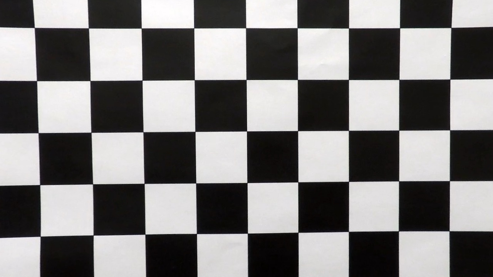
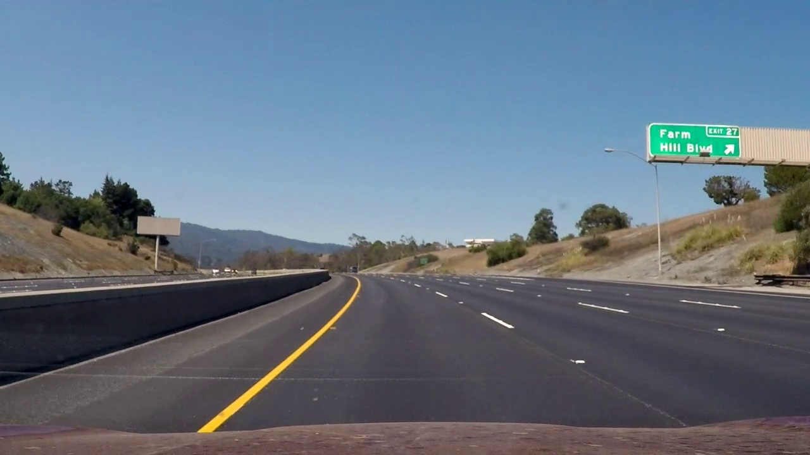
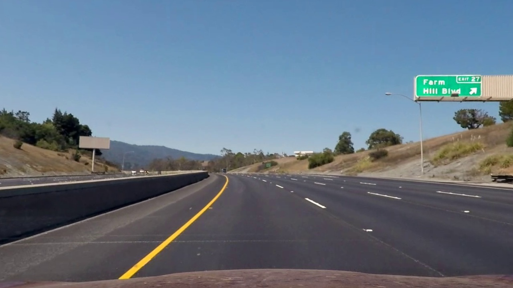

# Udacity Self Driving Car Nanodegree - Project 4
## Advanced lane finding

The aim of this project is to build upon the work carried out for [project 1](https://github.com/lewisHome/p1_LaneLines) and develop an image processing pipeline to identify lane markings. However in contrast to the pipeline developed in project 1 this pipeline must be able to measure the radius of curvature of any corners and calculate the position of the car with respect to the centre of its lane.

Further to the video files provided in the [Udacity project repository](https://github.com/udacity/CarND-Advanced-Lane-Lines) I decided to collect my own video files too. So I developed some tools to easily allow different cameras to be used. Unfortunatly more work is needed on these tools so I have not included the files in this repository.

### Camera Callibration
The program [Camera_Callibration.py](camera_callibration.py) is a utility to callibrate the camera used to collect the video data. The method is b based on the method detailed in the [OpenCV Documentation](http://opencv-python-tutroals.readthedocs.io/en/latest/py_tutorials/py_calib3d/py_calibration/py_calibration.html). To use the utility call the function from the command line
    
    $ python Camera_Callibration.py -camera_images -show_images -nx -ny

where;

-camera_images is the file containing the callibration images

-show_images is a flag to view the callibration images as they are being processed

-nx is the number of internal corners horizontally across the callibration image

-ny is the number of internal corners vertically across the callibration image

This utility outputs 4 .npy files which hold the callibration constants for to remove the inherant distortion from the camera images and are written to the file containing the callibration photos.

Here is an example of removing the distortion from a chess board image.

Origional Chess Board|Undistorted Chess Board
---------------|-----------------
|

### Lane Finding
The program [lane_finder.py](lane_finder.py) can be run from the command line.

    $python lane_finder.py -camera_data -test_data -output_file -record
    
Here;

-test_data is the video file you wish to process

-camera data should be the file containing the callibration data obtained by running the camera callibration utlilty described earlier. The program uses the Udacity Camera as default.

-output_file is the file path where you would like to store all processed data. This defaults to the 'output_images'

-record set to 'True' if you would like to record the video. If you do not record the video you have the option to run the perspective finder utility by pressing 'c', puasing the video and saving a snapshot by pressing 'p' and quiting the video early by pressing 'q'.

On startup if this is the first time the video has been run you will be prompted to run the perspective finder utility.

#### Perspective Finder Utility
I built the perspective finder so that I could easily modify the perspective transform for different videos. To run the utility press 'c' to callibrate while running lane_finder.py. It is best to run this routine on a straight piece of road if possible

Adjust the sliders above the images to adjust the perspective transformation. Once you are happy press 's' to save the the perspective transformation. Saving the trasnformation will overwrite any existing transformation associated with the video so press 'q' if you wish to quit without saving.

#### Lane Finding Pipe Line

Upon setting up the perspective transfom constants you can run the analysis. To find the lanes in the video images I take the following approach.

1.) Images are loaded from the video and camera distortions are removed using the undistort function on lines 36 -37.

Origional Image|Undistorted Image
---------------|-----------------
|

2.) Convert the colour image in to the HLS colour space and split the image into 3 black and white images for each colour space channel. The reason I did this is because under different lighting conditions different channels do a better job of highlighting lane lines. I then find edges using a Canny edge finder. This is all carried out in the thresh frame function on lines 40 - 55

Good Lighting | Bad Lighting
--------------|-------------
|

As the above images show in good light the lane lines appera very sharply in the S and L channels however under bad lighting conditions the lanes appear more clearly in the H Channel.

3.) The next step is to perform a perspective transform to provide a top down view of each image. THis is carried out using the perspectiveTransform function on lines 58 - 63.

3.)The next stpe is to find the lanes. This is carried out using the findLanes function o n lines 234 - 244. Initially the lanes are found using the sliding window technique described in the Udacity course notes. With the function find_window_centroids on lines 72 - 128. However once the lanes are found a mask is placed around the region where the lane was found in the previous image using the quickMask function - lines 179 - 200. the properties of the lane line are found with the function findCurvature on lines 150 - 176. And a confidence is found for the found line using the confidence function lines 203 - 232.

4.) Then a lane is chosen using the chooseLine function lines 249 -288. The best lane line is then recorded in the Line class found in LFUtils. If no lane is found wiht a suitably high score then the lane data is not updated, this is highlighted in the videos by highlighting the channels red.

5.) Upon determining what the most appropriate lane lines are the algorithm calculates the radius of curvature and the position of the car with respect to the centre of the road.

6.)Finally the images are assembled for display with appropriate markings and values indicated.

## Project Video

Click the image to view the results of the video processing pipeline on the project video. The pipeline performs quite well, occasionally it doesn't find a suitable lane but it gets away with it by using the last lane line found.

## Challenge Video

Click the image to view the results of the video processing pipeline on the challenge video. The pipeline performs very poorly and at no point does it even find the lanes to start working properly. This is becuase there is a lot of noise in the edge images. This could be improved by using a better thresholding technique, potentially applying a thresholding technique to the H,L and S images before using the canny edge function and then thresholding Sobel gradients after performing the perspective transform.

## Harder Challenge Video

The pipeline performs better on the harder challenge video than the challenge video. The lanes are intially found in the H and L channel as opposed the L and S channels where they were found in the project video. However the pipeline eventually looses the lane lines at a series of tight corners, potentially fitting a higher order polynomial to the lane lines could over come this problem.

## Conclusions
I tried to build a very general lanefinding system. I built a seperate camera callibration routine and utility to find the perspective transform. I did this becuase I collected my won data as well. Unforuntatly the method did not work well on my own data as there are some bugs with the perspective finder utility in regards to the shape of the output images. Generally my idea was to generate a a number of different ways of finding the lanes and choosing the best one, this works with very limited success. If I would take this work forward I should focus on generating more robust lane finding techniques for each of the H, L and S channels.